# Lateral Movement With RDP

<figure>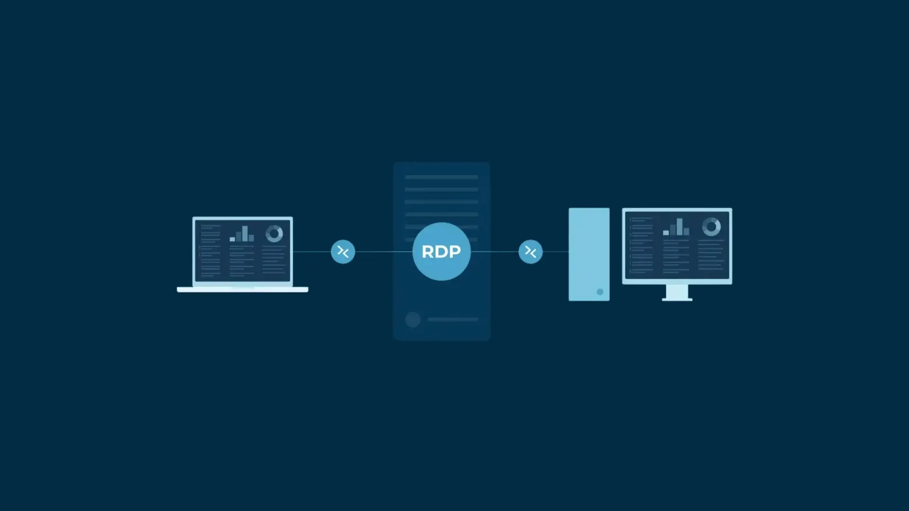<figcaption></figcaption></figure>

## <mark style="color:purple;">**Introduction**</mark>&#x20;

What is RDP : Remote Desktop Protocol is a protocol that runs over port ‘3389’ and allows you to connect from one system to another over a remote connection , It provides full GUI control of remote systems

<figure>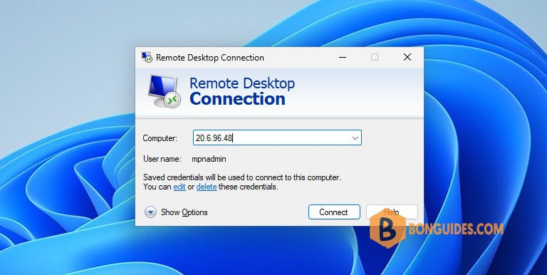<figcaption></figcaption></figure>

<mark style="color:$warning;">**How do I enable Remote Desktop?**</mark>

* Press the Win key to open the Start menu.
* Open Command Prompt as an admin.
* Type the below command and press Enter&#x20;

```
reg add "HKLM\SYSTEM\CurrentControlSet\Control\Terminal Server" /v fDenyTSConnections /t REG_DWORD /d 0 /
```

* Run the below command to enable remote desktop&#x20;

```
netsh advfirewall firewall set rule group="remote desktop" new enable=yes
```

\
<mark style="color:$warning;">**How do I disable Remote Desktop?**</mark>

* Press the Win key to open the Start menu
* Open Command Prompt as an admin
* Type the below command and press Enter :

```
reg add "HKLM\SYSTEM\CurrentControlSet\Control\Terminal Server" /v fDenyTSConnections /t REG_DWORD /d 1 /f
```

* Run the below command to disable remote desktop&#x20;

```
netsh advfirewall firewall set rule group="remote desktop" new enable=No
```

\ <mark style="color:$warning;">Common RDP Lateral Movement Techniques</mark>

*   #### **Credential Theft and Reuse** :

    #### Attackers employ multiple methods to harvest credentials:

    #### **1- LSASS Memory Extraction:** Mimikatz recover plaintext passwords from system memory **2- Keystroke Logging:** Capturing credentials during legitimate authentication. 3- **Credential Cache Attacks:** Exploiting Windows' credential storage mechanisms.
*   #### RDP Session Hijacking :&#x20;

    attackers may hijack existing RDP sessions. This technique involves the following steps : \
    1- Identifying active RDP sessions on a compromised system

    2- Elevating privileges to the SYSTEM level

    3- Taking control of the session token

    4- Redirecting the session to the attacker's client
* A common tactic is Pass-the-Hash (PtH), where attackers use captured NTLM hashes to authenticate to systems without needing to crack the password.Once credentials are obtained, attackers use standard RDP clients to connect to other systems where the credentials are valid.
* #### Exploiting RDP Vulnerabilities : The most infamous example is BlueKeep (CVE-2019-0708), a remote code execution vulnerability that affects older Windows systems , vulnerabilities like DejaBlue allow attackers to move between systems by exploiting RDP security flaws





### <mark style="color:$warning;">Real-World Attack Scenario</mark>

* An attacker gains initial access to a workstation through a phishing email.
* Using privilege escalation techniques, the attacker obtains administrative access to the workstation.
* The attacker runs Mimikatz to extract credentials from memory, retrieving the password hash of a domain administrator who previously logged into the system.
* With these credentials, the attacker establishes RDP connections to other systems within the network.
* Each compromised system yields new credentials, allowing access to additional systems.
* Eventually, the attacker reaches the domain controllers and gains persistent control over the entire network.

<mark style="color:$warning;">Notes</mark>&#x20;

* Evidence of "`mstsc.exe`" may indicate that a user attempted to execute RDP&#x20;
* Evidence of "`rdpclip.exe`" and "`tstheme.exe`" may suggest that the host saw an RDP connection

***

## <mark style="color:$info;">detecting RDP Activity via Event Logs</mark>

When analyzing RDP-related events, it is important to understand that Eboth the source computer (the system initiating the RDP session) and the destination computer (the system being accessed) store logs related to the session

<figure>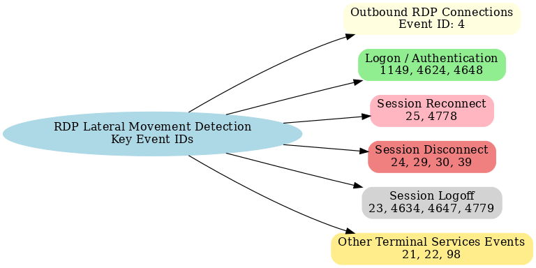<figcaption></figcaption></figure>

Microsoft-Windows-TerminalServices-RemoteConnectionManager/Operational : This log is particularly valuable because it records all RDP connection attempts, regardless of whether they succeed or fail. That makes it a strong indicator when investigating RDP-related activity.

<figure><figcaption></figcaption></figure>

<mark style="color:$warning;">**Event ID 1149**</mark>&#x20;

* This event is generated every time an RDP connection attempt occurs. successful connections, reconnections, and failed attempts alike.&#x20;
* records the Source IP and username of the connecting host
* TerminalServices - RemoteConnectionManager (Target system)
* **Note:** The phrase "User authentication succeeded" in the event description refers to network-level authentication (NLA), not full user logon.

<figure>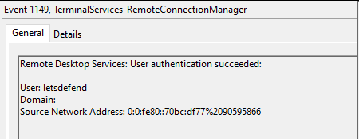<figcaption></figcaption></figure>

<mark style="color:orange;">**Event ID 4624**</mark>**&#x20; : An account was successfully logged on**

_**`Windows logon types`**_ :&#x20;

<figure><figcaption></figcaption></figure>



_**`For RDP analysis, we focus on`**_:

* **Logon Type 2:** Interactive (physical logon)
* **Logon Type 3:** Network logon (used in conjunction with others)
* **Logon Type 7:** Unlock (session unlock)
* **Logon Type 10:** Remote interactive (RDP or Terminal Services)

<figure>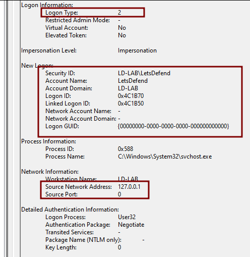<figcaption></figcaption></figure>

`Logon Type : 10 , 7 , 3`

* Logon Type 10 occurs only when a user connects to a system using RDP and the account is not already logged in&#x20;
* Example : let’s consider that Anas is already logged in (or her session is locked), and someone connects via RDP using Alice’s credentials. In this case, **Logon Type 7** is recorded. Logon Type 7 indicates a **“Unlock” or reauthentication of an existing session**, rather than a brand-new session.\
  If a different user establishes a new RDP session, then **Logon Type 10** is recorded
* If Network Level Authentication (NLA) is enabled, you will typically observe Logon Type 3 followed by either Type 10 (for new sessions) or Type 7 (for reconnections).

<figure>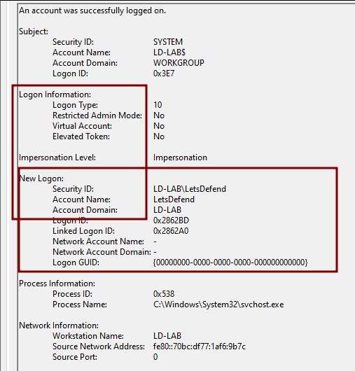<figcaption></figcaption></figure>

Logon Type 3 : provides the source workstation name, which helps identify the origin of the RDP connection

<figure>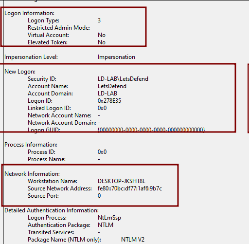<figcaption></figcaption></figure>

<mark style="color:$warning;">**Event ID : 21 and 22 , 98 " Terminal Service "**</mark>

* **Event ID 21** : Remote Desktop Services: Session logon succeeded
* **Event ID 22** : Remote Desktop Services: Shell start notification received.
* These events confirm that the user session has started and a shell (e.g., Windows Explorer GUI)
* Event ID 98 :Remote Desktop Services - RDP Core TS (Target system) -correlates with the above (131) event ID and will record successful connections.&#x20;

<figure>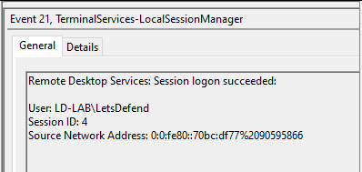<figcaption></figcaption></figure>

<figure>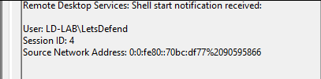<figcaption></figcaption></figure>

<mark style="color:$warning;">**Event ID : 25 , 4778 "**</mark><mark style="color:$warning;">Terminal Services"</mark> <mark style="color:$warning;"></mark><mark style="color:$warning;">**(Session Reconnect)**</mark>&#x20;

* Remote Desktop Services: Session reconnection succeeded.
* If a user disconnects an RDP session (by closing the client,..), the session stays active but locked. Reconnecting does not trigger a full new logon. In this case, **Logon Type 7** (unlock) is recorded instead of **Logon Type 10**. As usual, it is preceded by **Logon Type 3** (network logon)
* Event ID 4778 : enerated when a session is reconnected via Terminal Services&#x20;

<div><figure><figcaption></figcaption></figure> <figure>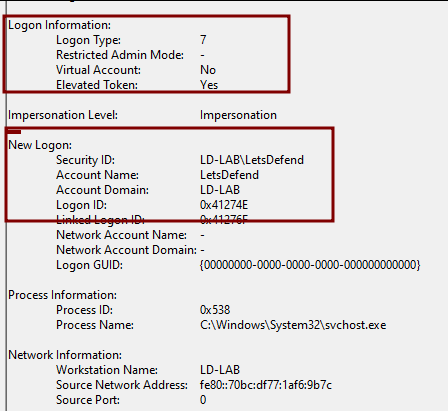<figcaption></figcaption></figure> <figure><figcaption></figcaption></figure></div>

<mark style="color:$warning;">**Event ID : 24 , 29  , 30 (Session Disconnect)**</mark>

* **Event ID 40** : SESSION X has been disconnected. reason code X (This event gives a reason code explaining why the session was disconnected (e.g., user action, timeout, etc.).
* **Event ID 24** : Session has been disconnected.
* **Event ID 39** : Session X has been disconnected by Session X ( This shows when one session forces another to disconnect commonly happens if a new RDP login ends an active session )
* This sequence of events is often followed by Event ID 4634 in the Security event log, which confirms that the account was logged off.

<div><figure>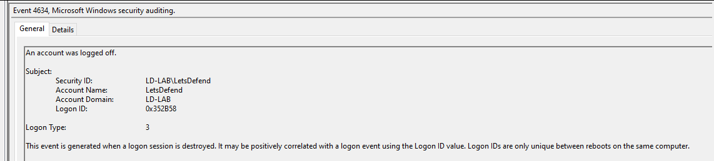<figcaption></figcaption></figure> <figure>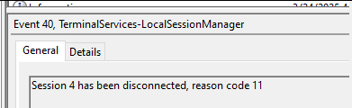<figcaption></figcaption></figure> <figure>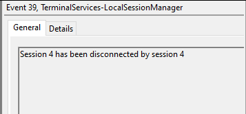<figcaption></figcaption></figure> <figure>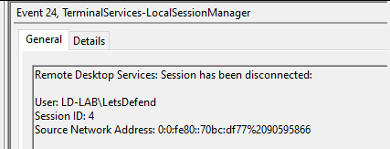<figcaption></figcaption></figure> <figure>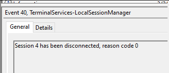<figcaption></figcaption></figure></div>

#### <mark style="color:$warning;">**Event ID : 23 ,**</mark> <mark style="color:$warning;"></mark><mark style="color:$warning;">4779</mark><mark style="color:$warning;">**"Windows-TerminalServices" , 4634 and 4647 "Security" ( RDP Session LogOff)**</mark>

* **Event ID 23** : Remote Desktop Services: Session logoff succeeded
* **Event ID 4634** : An account was logged off.
* **Event ID 4647** : User initiated Logoff.
* Event ID : 4779 : recorded when a user disconnects from a terminal services session.

<div><figure>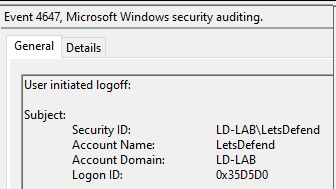<figcaption></figcaption></figure> <figure>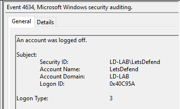<figcaption></figcaption></figure> <figure>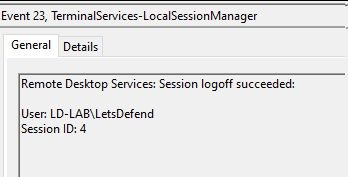<figcaption></figcaption></figure></div>

<mark style="color:$warning;">**Event ID : 4648**</mark>

* known as an “explicit logon” \*These are observed with numerous remote connections, not just RDP

<mark style="color:$warning;">**Event ID : 1102 , 1024 (outbound RDP connections)**</mark>&#x20;

* Terminal Services RDPClient (⇒ Source System)
* records the target hostname , IP&#x20;

<mark style="color:blue;">**`LAB`**</mark>

we Have "2" Files ( Terminal-Service Logs AND Security Logs of The target Machine ) and we want to identify the first successful RDP logon , What is the internal host from which the attacker laterally moved

From Security Logs We filtered By Even ID : 4624 To list all Login successful and specially look for logon Type : 3 Followed By Logon type : 10 "indicator of RDP Connection is successfully"

<figure><figcaption></figcaption></figure>

&#x20;the attacker is authenticated via network in "4/22/2025 3:37:18 AM" and he is tried to connect By RDP

<figure><figcaption></figcaption></figure>

we observed also multiple login failure from the attacker "indicator of Brute-Force"

we can filter by **Event ID 1149 @ terminal-service logs : that record** the Source IP and username of the connecting host

<figure><figcaption></figcaption></figure>

***

## <mark style="color:purple;">Detecting RDP Activity via Process Execution</mark>

We'll approach this from two perspectives:

* **The Source Machine:** Where the RDP session was initiated.
* **The Target Machine:** The system that was accessed remotely.

notes :&#x20;

* On the **source system**, RDP clients are usually launched through the _**`GUI`**_, so artifacts like **`UserAssist`** and **`RecentApps`**&#x61;re highly relevant.
* On the **target system**, RDP sessions are initiated in the background by the OS, not directly by the user. As a result, GUI-based artifacts (e.g., **UserAssist**) won’t appear. Instead, the focus shifts to **`Prefetch`**&#x61;nd other **system-level artifacts**
* **Source ⇒ UserAssist , RecentApps**
* **Target ⇒** Prefetch , **Shimcache , Amcache**
* When they initiate an RDP session, the process “mstsc.exe” is executed. This is the Microsoft Remote Desktop Client, used to connect to and control remote computers or Remote Desktop Session Host (RDSH) servers.
* We can find process execution evidence of “mstsc.exe” through various artifacts such as:
  * RecentApps
  * Prefetch
  * UserAssist
  * BAM (Background Activity Moderator)









\
<mark style="color:orange;">**Source Computer**</mark>

* we will examine UserAssist and BAM artifacts to identify execution of “mstsc.exe”, or its registered name, Microsoft.Windows.RemoteDesktop.

<figure>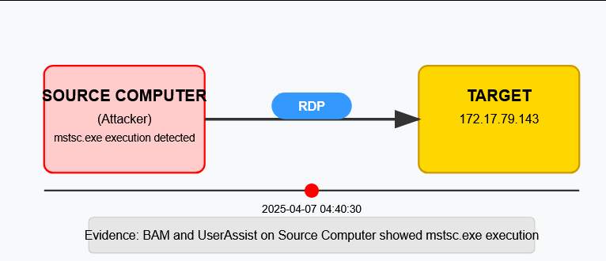<figcaption></figcaption></figure>

* the attacker initiates an RDP session to the IP address “172.17.79.143”

<figure>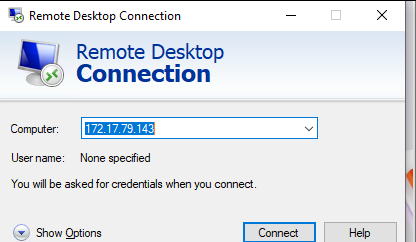<figcaption></figcaption></figure>

After conducting activity on the remote system we investigate the source system for process execution of “mstsc.exe”.

The “ **UserAssist”** artifact is stored in the user's “NTUSER.DAT” registry hive. Open it with Registry Explorer to examine the path:

```
Software\Microsoft\Windows\CurrentVersion\Explorer\UserAssist
```

Here we see the program name instead of the exact executable (mstsc.exe). In this case, Microsoft.Windows.RemoteDesktop. (**Run Counter , last executed , Focus Time )** we confirm that the RDP client was last run at: “ **2025-04-07 05:40:30** ”.

<figure>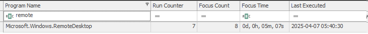<figcaption></figcaption></figure>

examine the “ **BAM (Background Activity Moderator)** ”, which is stored in the SYSTEM registry hive&#x20;

```
SYSTEM\bam\State\UserSettings\<USER-SID>
```

The BAM entry also shows “mstsc.exe” and a matching timestamp, reinforcing the finding from “UserAssist”.

<div><figure>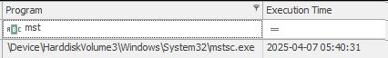<figcaption></figcaption></figure> <figure>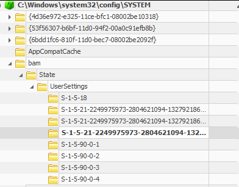<figcaption></figcaption></figure></div>

#### <mark style="color:$warning;">Target System</mark>

we look for execution of the following RDP-related processes:

* rdpclip.exe – Manages clipboard redirection during RDP sessions.
* tstheme.exe – Handles remote desktop theming.

These processes are spawned by the system, not manually executed by a user. Therefore, artifacts like “UserAssist” or “RecentDocs” will not contain evidence of their activity.Instead, we turn to the prefetch artifact.\
**Note:** Windows Server often has prefetch disabled by default, in which case we can use other artifacts like “Shimcache” or “Amcache”. In this example, we use Prefetch.

<figure>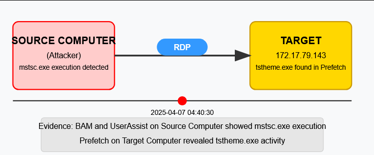<figcaption></figcaption></figure>

To parse prefetch data, we use PECmd by Eric Zimmerman.This command parses all prefetch files located at “C:\Windows\Prefetch” and exports the results to “targetsystem.csv”.

```
PECmd.exe -d "C:\Windows\Prefetch\" --csvf targetsystem.csv --csv .
```

We find evidence of “TSTHEME.exe” in prefetch.

<figure>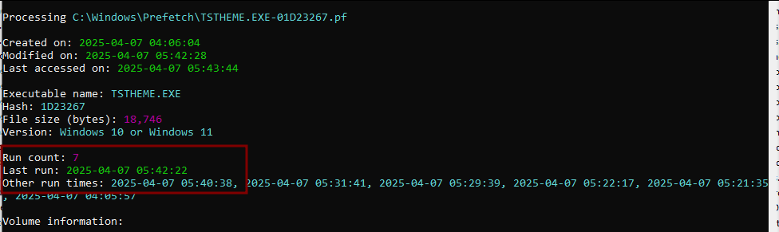<figcaption></figcaption></figure>

Note the last run timestamp is: **2025-04-07 05:42:22** This matches the expected timeline. The RDP session was initiated at 05:40:30 (from the source), and the connection was fully established by around 05:40:38. The later timestamp likely reflects the end of the session.\
The 7-second gap between source and target logs is normal and represents the time it took to establish the session.

_**`Lab`**_&#x20;

we need to answer this questions :&#x20;

* When did the threat actor initially start their RDP session from the source system after the brute-force attack?
* Based on the UserAssist artifact from the source system, when was the Microsoft Remote Desktop app last executed?
* According to the UserAssist data from the source system, what was the total focus time for the Microsoft Remote Desktop app?
* Analyze the artifacts of the target system. When was the RDP clipboard-related process executed for the first time on the incident date on the target system?
* What is the latest execution timestamp for “tstheme.exe” on the target system?

lets practice

from previous investigation we identified the attacker has successful loin "4/22/2025 3:37:18 AM" so all events approximately after this time slightly&#x20;

We'll check **UserAssist**, but that's not proof this was the attacker's _first_ RDP session after the brute-force  the attacker could have disconnected and reconnected. **UserAssist** only shows the _last_ time an item was executed.

<div><figure><figcaption></figcaption></figure> <figure><figcaption></figcaption></figure> <figure><figcaption></figcaption></figure></div>

from user assist ⇒ last executed : 03:51:44&#x20;

From BAM : execution time of mstsc : 03:56:08 ( there is a gap between them )&#x20;

<div><figure><figcaption></figcaption></figure> <figure><figcaption></figcaption></figure> <figure><figcaption></figcaption></figure></div>

Let's analyze the **Prefetch** files on the source machine, list every time **mstsc.exe** was executed, and take the earliest timestamp after 4/22/2025 3:37:18 AM" that earliest run likely corresponds to the initial RDP connection.

<div><figure><figcaption></figcaption></figure> <figure><figcaption></figcaption></figure></div>

the threat actor initially start their RDP session : 03:37:46 which a mstsc.exe was installed after login successfully

from the target prefetch file :&#x20;

* RDPCLIP.exe was created : 03:38:17 on the target machine

<figure><figcaption></figcaption></figure>

time line :&#x20;

* 3:37:18 ⇒ login successfully&#x20;
* 03:37:46 ⇒ mstsc.exe ( source )
* 03:38:17 ⇒ RDPCLIP.exe ( target )

***

## <mark style="color:purple;">**Detecting RDP Activity via Registry**</mark>

We will focus on the Remote Desktop Connection MRU (Most Recently Used) artifact, located in the following registry path:

```
NTUSER\Software\Microsoft\Terminal Server Client\Servers
```

This artifact is only available when the connection is made using the default Windows RDP client: “Microsoft Remote Desktop Connection (RDC)”

Under the default key, you'll find entries beginning with “MRU” followed by a number (e.g., MRU0, MRU1). These entries represent a list of RDP connections in the order they were made.

* **“MRU0”** is the most recent connection,
* Subsequent numbers represent older connections.

<figure>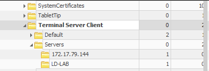<figcaption></figcaption></figure>

<figure>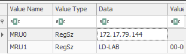<figcaption></figcaption></figure>

If you click on the “Terminal Server Client” root key, you’ll see a summary of RDP connection history. This includes:

* The `hostname` or IP address
* The user account used to initiate the connection
* The last write timestamp of the key

<figure>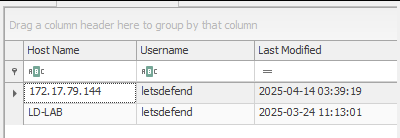<figcaption></figcaption></figure>

`LAB`&#x20;

* What is the full name of the compromised account used for lateral movement?
* What is the hostname of the system to which the attacker moved?
* According to the “Terminal Server Client” registry key, when was the first connection attempt to the system made?

from ⇒ ntuser.dat&#x20;

<figure><figcaption></figcaption></figure>

<figure><figcaption></figcaption></figure>

<figure><figcaption></figcaption></figure>

***

## Detecting RDP Activity via Bitmap Cache

* **Bitmap caches in RDP** are used to improve performance by avoiding the need to resend the same graphics repeatedly. The cache stores small image fragments (bitmaps) on both the client and server.
* Each cache has a fixed **tile size** the maximum dimensions for a single stored bitmap. If an image is larger than this size, it cannot fit into one cache entry. In that case, the server applies a **tiling algorithm**, which breaks the larger image into smaller tiles that do fit.&#x20;
* These tiles are then stored separately in the cache and reassembled by the client when displaying the screen.
* In simpler terms, this caching mechanism helps improve the performance of RDP sessions by storing frequently used graphical elements. Bitmap cache files are located at:

```
Bitmap Cache : C:\Users\[Username]\AppData\Local\Microsoft\Terminal Server Client\Cache\
```

In this example, we observe three cache files with numerical suffixes like “00”, “01”, and “02”. These represent different RDP sessions, with the highest number (e.g., “02”) typically being the most recent.

<figure><figcaption></figcaption></figure>

#### Parsing Cache to Extract Bitmap Images

The cache files by themselves aren't very readable. To extract usable images from them, we can use a tool called [BMC-TOOLS](https://github.com/ANSSI-FR/bmc-tools) , available on GitHub. This tool converts raw bitmap cache data into actual imag

<figure>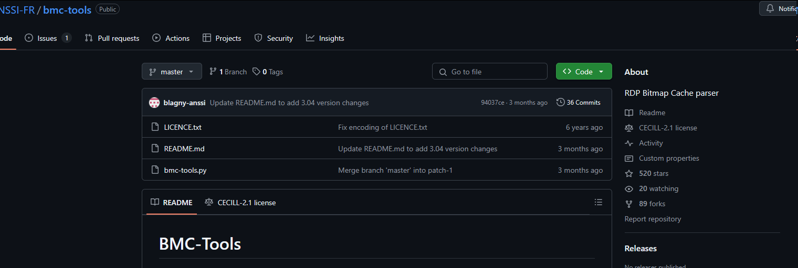<figcaption></figcaption></figure>

```
python3 bmc-tools.py -s "C:\Users\LetsDefend\AppData\Local\Microsoft\Terminal Server Client\Cache" -d "C:\Users\LetsDefend\Downloads\bitmap_parsed_LetsDefend" -b

//  -b : Creates a collage of the extracted bitmaps for easier review. 
```

Since we're primarily interested in the most recent RDP session, we will focus only on images extracted from the “Cache0002” file.

<figure>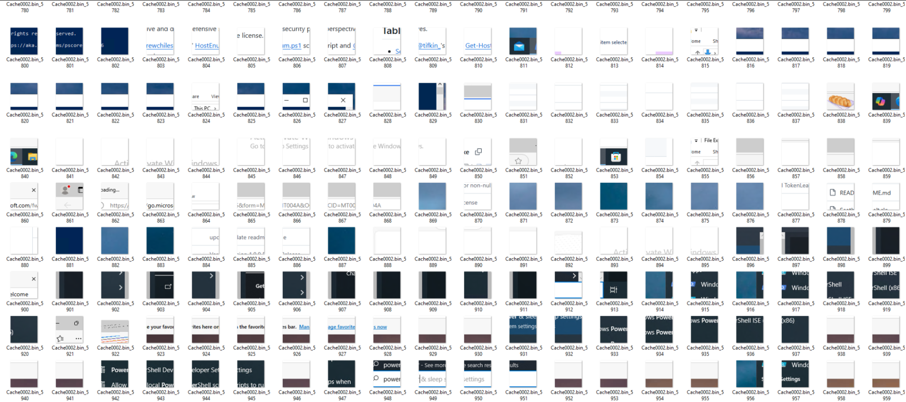<figcaption></figcaption></figure>

### Analyzing the Bitmap Images

Now that we have extracted hundreds of bitmap images from the cache files, we need to analyze them to understand what happened during the RDP session. These individual image tiles are often fragmented and not meaningful on their own. To help reconstruct them into readable screenshots, we will use a powerful tool called [RDP Cache Sticher](https://github.com/BSI-Bund/RdpCacheStitcher)&#x20;

Before using the tool, let’s briefly review the collage image generated during extraction. This provides a rough overview by combining all tiles into a single large image.

<figure>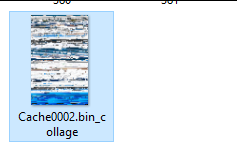<figcaption></figcaption></figure>

<figure>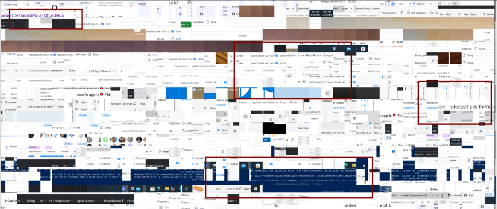<figcaption></figcaption></figure>

we notice suspicious activity: Microsoft Defender is visible, along with a GitHub repository for a post-exploitation tool called “ **SeatBelt** ”.

**`RDP Cache Stitcher`** :&#x20;

* To further enhance the visibility of the session, we use a tool called “RDP Cache Stitcher”.
* Once loaded, you’ll see stitched images that provide a much clearer view of the RDP session activity. Although the order may not be perfect, the accuracy is quite high (around 90%).

<figure>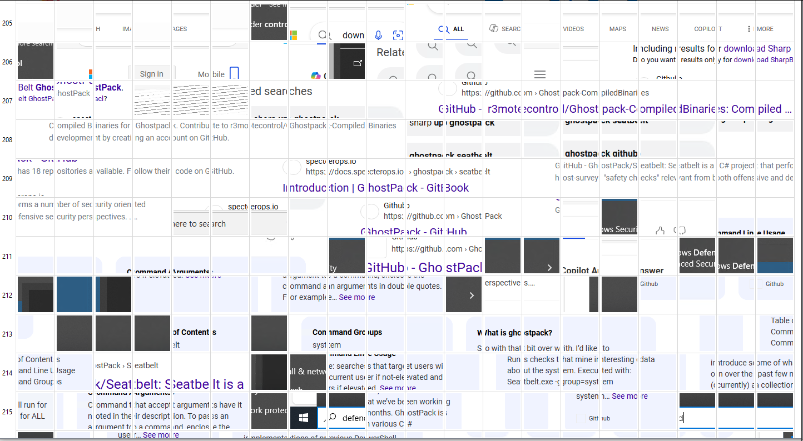<figcaption></figcaption></figure>

From the reconstructed images, we can draw several conclusions about the session:

* The user opened “ **Microsoft Edge** ” and visited the “ **GhostPack** ” GitHub repository.
* The specific “ **SeatBelt** ” repository was accessed and the binary was downloaded.
* **“Windows Defender** ” initially blocked the binary.
*   Afterward, the user disabled Windows Defender and re-downloaded the tool successfully.

    There is also PowerShell activity, a ping to the letsdefend domain.

<figure>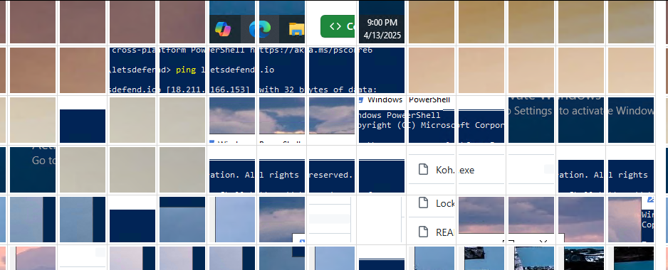<figcaption></figcaption></figure>


