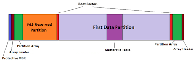

# LAB : NTDS dumping attack

<figure><figcaption></figcaption></figure>

**Sherlock Scenario :** \
**Forela's domain controller is under attack. The Domain Administrator account is believed to be compromised, and it is suspected that the threat actor dumped the NTDS.dit database on the DC. We just received an alert of vssadmin being used on the DC, since this is not part of the routine schedule we have good reason to believe that the attacker abused this LOLBIN utility to get the Domain environment's crown jewel. Perform some analysis on provided artifacts for a quick triage and if possible kick the attacker as early as possible.**

***

```
Q1- Attackers can abuse the vssadmin utility to create volume shadow snapshots and
 then extract sensitive files like NTDS.dit to bypass security mechanisms. Identify the 
 time when the Volume Shadow Copy service entered a running state.
```

**from the "SYSTEM" Logs**

<figure><figcaption></figcaption></figure>

<figure><figcaption></figcaption></figure>

**ans ⇒ 2024-05-14 03:42:16**

***

```
Q2- When a volume shadow snapshot is created, the Volume shadow copy service validates the
privileges using the Machine account and enumerates User groups. Find the two user groups
the volume shadow copy process queries and the machine account that did it

```


**You always need to pay close attention to the timeline when performing an investigation.**\
**We identified that the Volume Shadow Copy was created on 2024-05-14 at 03:42:16. Based on that, you will find the enumeration.**\
**Make sure to verify that the process responsible for the enumeration is indeed the process of the Volume Shadow Copy.**

**from "SECURITY" Logs**

<figure><figcaption></figcaption></figure>

**he primary process name for the Volume Shadow Copy Service in Windows is `VSSVC.exe`, which is the executable for the service named Volume Shadow Copy Service (VSS)**

<figure><figcaption></figcaption></figure>

<figure><figcaption></figcaption></figure>

**ans ⇒ Administrators, Backup Operators, DC01$**

***

```
Q3- Identify the Process ID (in Decimal) of the volume shadow copy service process.
```

<figure><figcaption></figcaption></figure>

<figure><figcaption></figcaption></figure>

**ans ⇒ 4496**

***

```
Q4- Find the assigned Volume ID/GUID value to the Shadow copy snapshot when it was mounted.
```

**from "NTFS" Logs**

**NTFS Event ID 4  : often a warning related to the NTFS transaction log failing to start due to an unrepeatable error on a specific volume, indicating potential disk or system corruption**

**The first thing you should focus on is the timeline.**

<figure><figcaption></figcaption></figure>

**ans ⇒ {06c4a997-cca8-11ed-a90f-000c295644f9}**

***

```
Q5- Identify the full path of the dumped NTDS database on disk.
```

**Parse the MFT file using MFTCMD From eric**

<figure><figcaption></figcaption></figure>

**The Master File Table (MFT) is a core component of the NTFS (New Technology File System) used by Windows, serving as a database or index that stores information for every file and directory on an NTFS volume, such as its name, size, timestamps, permissions, and pointers to its data.**

<figure><figcaption></figcaption></figure>

**The MFT contains an entry, or record, for each file and directory, and when files are created or deleted**\
**it stores metadata about each file, including: File name , Size and timestamps (creation, modification)  , Permissions and access control lists , Pointers to the location of the file's data on the disk**&#x20;

**The output I got from mftcmd was an Excel file, but it was messy and full of logs. So, I used the Timeline Explorer tool to organize everything better and searched for ntds.dit.**\
**I found an unusual path, which indicated that it was the result of the attacker’s actions.**

<figure><figcaption></figcaption></figure>

ans ⇒ C:\Users\Administrator\Documents\backup\_sync\_Dc\Ntds.dit

***

```
When was newly dumped ntds.dit created on disk?
```

<figure><figcaption></figcaption></figure>

ans ⇒ 2024-05-14 03:44:22

***

```
A registry hive was also dumped alongside the NTDS database. Which registry hive was dumped and what is its file size in bytes?
```

**It’s very likely that the attacker would use the same folder to dump ntds and system.**\
**So, I filtered the MFT using this path: `.\Users\Administrator\Documents\backup_sync_dc`.**

<figure><figcaption></figcaption></figure>

***
