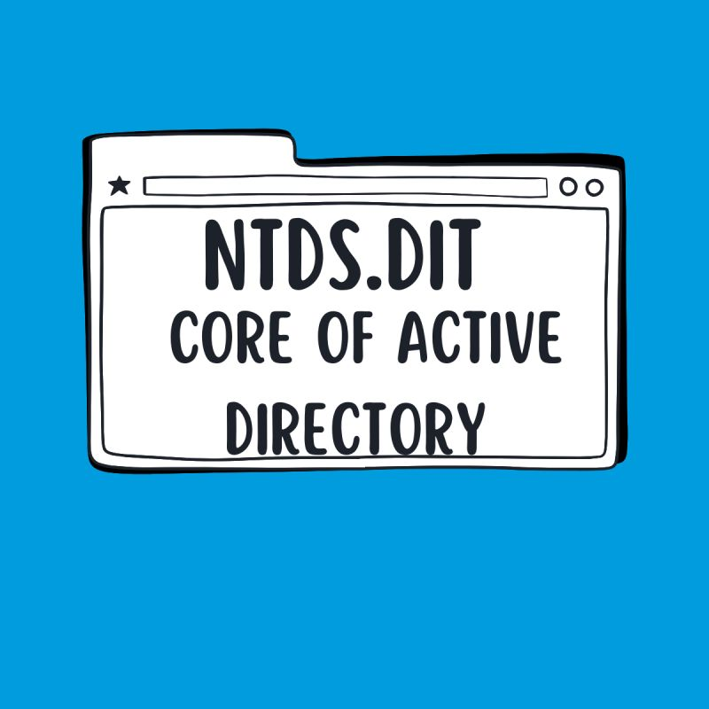

# NTDS dumping attack

<figure><figcaption></figcaption></figure>

***

## <mark style="color:purple;">preparation</mark>&#x20;

**What NTDS.dit ?**\
&#x20;**containsThis single database file stores essential information for managing and authenticating users and resources across a network. It contains:**&#x20;

* **Users, groups, and computers: Details about every object in the domain.**
* **Password hashes**
* **Group memberships: Records of which users belong to which groups.**
* **Schema definitions: The rules that define the structure and attributes of all objects in the directory.**
* **Configuration data: Information about the domain's structure, replication settings, and more.**&#x20;

***

Adversaries may attempt to access or create a copy of the Active Directory domain database in order to steal credential information, as well as obtain other information about domain members such as devices, users, and access rights. By default, the NTDS file (NTDS.dit) is located in `%SystemRoot%\NTDS\Ntds.dit` of a domain controller.[<sup>\[1\]</sup>](https://en.wikipedia.org/wiki/Active_Directory)

registry path :&#x20;

```
HKEY_LOCAL_MACHINE\SYSTEM\CurrentControlSet\Services\NTDS\Parameters
```

In addition to looking for NTDS files on active Domain Controllers, adversaries may search for backups that contain the same or similar information.[<sup>\[2\]</sup>](http://adsecurity.org/?p=1275)

The following tools and techniques can be used to enumerate the NTDS file and the contents of the entire Active Directory hashes.

* Volume Shadow Copy
* secretsdump.py
* Using the in-built Windows tool, ntdsutil.exe
* Invoke-NinjaCopy



<figure><figcaption></figcaption></figure>

After obtaining the password hashes from the NTDS.dit file, attackers can attempt to crack them offline to obtain the plaintext passwords. If they are unable to crack the hashes offline, they could also try using the password hashes in [pass-the-hash attacks](https://academy.hackthebox.com/course/preview/password-attacks) to further exploit the environment.

A Pass-the-Hash (PtH) attack is a technique where an attacker captures a password hash (as opposed to the password characters). The threat actor then passes it through for authentication and lateral access to other networked systems.

<figure><figcaption></figcaption></figure>

**NTDSUTIL**is a Microsoft command-line tool for managing [Active Directory Domain Services (AD DS) database](https://www.google.com/search?client=firefox-b-d\&sca_esv=efbb7c509a58d99b\&sxsrf=AE3TifPZ65_nlw3bvnyC-U7vU_KObrvokA%3A1759651369210\&q=Active+Directory+Domain+Services+%28AD+DS%29+database\&source=lnms\&fbs=AIIjpHxU7SXXniUZfeShr2fp4giZ1Y6MJ25_tmWITc7uy4KIeoJTKjrFjVxydQWqI2NcOhYPURIv2wPgv_w_sE_0Sc6QqqU7k8cSQndc5mTXCIWHa_uc-TjDJYRtLl-RKXlVOTL5mI-WiiglTJRFGvAEXXnfWyfSz0RcKTdc0SVijutDrGKDjzC7BDwXiykPpSqg3pwIolHdg3emZvghVVSMs5T2veRtSA\&sa=X\&ved=2ahUKEwjHs42vzIyQAxWNVaQEHTWBIHIQgK4QegQIARAC\&biw=1485\&bih=711\&dpr=1.25\&mstk=AUtExfDLiipAQh7xSIma1SrCgKkpA21WUX53WAP1fG0DRiZY87gdyZd6T9tvnE7AIu-tzrZIzdidAN2hfz5kUFxJ1OLz07Be4doY6fC_SL9lWBvwm5gi93fv5DWVkLk9IPjpAhVTi44w4YgWVIldszOpEaNw2zEyPI2cePvnB9nLMAvSdPy7p212TexhgDYRmkt-2S2h1FWVU3cK_N8fwDesdIYmFAG9Pq7050vbzlaE3eq9g6teXlxEY4aWylI8T-eo0HNZdr1VHiUkmujRTEUL9Fyu0nwuHai2Wz8IulN1weZulw\&csui=3) and performing advanced maintenance tasks, such as database cleanup, restoring snapshots, and managing [single master operation roles](https://www.google.com/search?client=firefox-b-d\&sca_esv=efbb7c509a58d99b\&sxsrf=AE3TifPZ65_nlw3bvnyC-U7vU_KObrvokA%3A1759651369210\&q=single+master+operation+roles\&source=lnms\&fbs=AIIjpHxU7SXXniUZfeShr2fp4giZ1Y6MJ25_tmWITc7uy4KIeoJTKjrFjVxydQWqI2NcOhYPURIv2wPgv_w_sE_0Sc6QqqU7k8cSQndc5mTXCIWHa_uc-TjDJYRtLl-RKXlVOTL5mI-WiiglTJRFGvAEXXnfWyfSz0RcKTdc0SVijutDrGKDjzC7BDwXiykPpSqg3pwIolHdg3emZvghVVSMs5T2veRtSA\&sa=X\&ved=2ahUKEwjHs42vzIyQAxWNVaQEHTWBIHIQgK4QegQIARAD\&biw=1485\&bih=711\&dpr=1.25\&mstk=AUtExfDLiipAQh7xSIma1SrCgKkpA21WUX53WAP1fG0DRiZY87gdyZd6T9tvnE7AIu-tzrZIzdidAN2hfz5kUFxJ1OLz07Be4doY6fC_SL9lWBvwm5gi93fv5DWVkLk9IPjpAhVTi44w4YgWVIldszOpEaNw2zEyPI2cePvnB9nLMAvSdPy7p212TexhgDYRmkt-2S2h1FWVU3cK_N8fwDesdIYmFAG9Pq7050vbzlaE3eq9g6teXlxEY4aWylI8T-eo0HNZdr1VHiUkmujRTEUL9Fyu0nwuHai2Wz8IulN1weZulw\&csui=3)\
attacker can exploit **NTDSUTIL** to gain access to this database

<figure><figcaption></figcaption></figure>

Here are some common methods of acquiring _NTDS.dit_:

1. Access the virtual hard drive directly for a DC based on a VM
2. Use [ntdsutil](https://learn.microsoft.com/en-us/previous-versions/windows/it-pro/windows-server-2012-r2-and-2012/cc753343\(v=ws.11\))
3. Use [diskshadow](https://learn.microsoft.com/en-us/windows-server/administration/windows-commands/diskshadow)
4. Use [vssadmin](https://learn.microsoft.com/en-us/windows-server/administration/windows-commands/vssadmin)\*
5. Use wmic\*



<figure><figcaption></figcaption></figure>




Attack Tutorial: How NTDS.dit Password Extraction Works





***

## <mark style="color:purple;">**Detection**</mark> <a href="#mcetoc_1i6eoeekd77" id="mcetoc_1i6eoeekd77"></a>

**`Event ID 325 and 327`**

* from Application, system & security logs&#x20;
* event source “ESENT” in application logs.
* These events are logged when a new database is created and when a database is detached respectively.

<figure><figcaption></figcaption></figure>

We need to look for any file path for the newly created database (such as a dumped copy of the original NTDS.dit) besides its original path of %SystemRoot%\ntds. Any copy of NDTS.dit present in another location strongly indicates malicious behavior.

<figure><figcaption></figcaption></figure>

<figure><figcaption></figcaption></figure>

**`event ID 7036`**

* system log
* orrelate with our application logs findings

we see two services related to Volume shadow, which started running just a second before the creation of the NTDS.dit database

<div><figure><figcaption></figcaption></figure> <figure><figcaption></figcaption></figure></div>

**`event ID 4799`**

* Security logs

We need to look for an event where two security groups (**Backup Operators** and **Administrator**) were being enumerated by the ntdsutil.exe process

<div><figure><figcaption></figcaption></figure> <figure><figcaption></figcaption></figure></div>

<figure><figcaption></figcaption></figure>

**`Event ID 4688 (Microsoft Windows Security Auditing) and 1 (Microsoft Windows Sysmon)`**

* provide context of commands and parameters being executed via creation of a new process

**`Event ID 800 (PowerShell)`**

* provides context of commands and parameters being executed via PowerShell "800"

**Command line attempt to access or create a copy of ntds.dit file**

((sourcetype="WinEventLog:Microsoft-Windows-Powershell/Operational" EventCode="800") AND((CommandLine LIKE "%ntds%" AND CommandLine LIKE "%ntdsutil%" AND CommandLine LIKE "%create%") OR (CommandLine LIKE "%vssadmin%" AND CommandLine LIKE "%create%" AND CommandLine LIKE "%shadow%") OR (CommandLine LIKE "%copy%" AND CommandLine LIKE "%ntds.dit%")))

**`Events 4656 and 4663`**&#x20;

* provide context of processes and users requesting access or accessing file objects (ObjectType = File) such as C:\Windows\NTDS\ntds.dit

**`Events 4656 and 4663 (Microsoft Windows Security Auditing)`**

* &#x20;provide context of processes and users creating or copying file objects (ObjectType = File) such as C:\Windows\NTDS\ntds.dit

**`Event 11 (Microsoft Windows Sysmon)`**

* &#x20;provide context of processes and users creating or copying files. Unfortunately, this event provides context of the file being created or copied, but not the file being copied.
*   Active Directory Dumping via NTDSUtil

    **(sourcetype=WinEventLog:Security EventCode IN (4656, 4663)) OR (sourcetype=WinEventLog:Microsoft-Windows-Sysmon/Operational EventCode="11") ANDObjectType="File" AND TargetFilename="\*ntds.dit" AND (AccessList="%%4416" OR AccessList="%%4419" OR AccessList="%%4417" OR AccessList="%%4424")**

***
