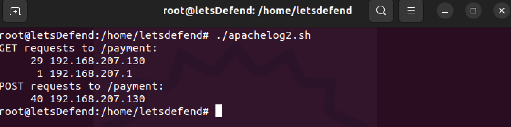

# Bash Scripting for Blue Team

<figure><figcaption></figcaption></figure>

***

### <mark style="color:purple;">Escaping Errors</mark>

When adding values of variables directly to commands, there is always a risk that these values are manipulated and may cause a command to run differently than expected.\
⇒ In this example, we do not use double quotes when using our variable. Therefore, the “cd” command is misinterpreted and gives the error message you see below

```
#!/bin/bash
drectory_name="lets defend"
cd $directory_name
// 
cd lets defend
```

<figure><figcaption></figcaption></figure>

The cd command read the word "defend" as an argument, but, because it did not expect such an argument, it could not understand it and gave an error. So, what would happen if we used it in the following way?

```

#!/bin/bash
drectory_name="lets defend"
cd "$directory_name"
// 
cd 'lets defend'
```

***

### <mark style="color:green;">Untrusted Inputs</mark>

bash scripts accept untrusted input allows attackers to execute malicious code. To prevent this type of attack, we must always verify and sanitize user inputs.

Example : we ask the user for a file name and print the contents of the file with that name to the console

```
#!/bin/bash
echo "Input file name:"
read file
cat $file
```

this is an untrusted script : A malicious user may attempt to wipe the entire file system by entering a malicious command like “rm -rf /” to the file variable\
⇒ in this example, the variable file checks for a file (-f $file) and checks if it has a .txt extension ($file == \*.txt). If these conditions are not met, an error message is given to the user.

```
#!/bin/bash
echo "input file name:"
read file
if [[ -f $file && $file == *.txt ]]; then
    cat "$file"
else
    echo "Please input .txt file name"
fi
```

⇒ example, the user-input variable filename is used directly in the cp command. A malicious user can change the target filename, causing unexpected results.

```
#!/bin/bash
echo "input file name:"
read filename
cp $filename /tmp/backup
```

The correct approach is to check and sanitize the user's input:

```
#!/bin/bash
echo "input file name:"
read filename
if [[ $filename =~ ^[a-zA-Z0-9_-]+$ ]]; then
    cp "$filename" /tmp/backup
else
    echo "invalid file name."
fi
```

A very common mistake is to continue the execution of the script without verifying whether these commands are successfully executed or not. If not, our script may start producing unpredictable results.

In our example, we “ **scp** ” a file to a remote server and then delete the local file. Although everything seems working fine, we actually have a faulty code because we have not checked whether the required connection for “ **scp** ” is available or not, whether the “ **scp** ” suns successfully or not.

```
#!/bin/bash
remote_host="192.168.0.100"
remote_user="user"
filename="important.txt"

scp $remote_user@$remote_host:$filename /tmp/backup >/dev/null 2>&1
echo "File copied successfully."
rm -rf filename
```

⇒ First, we could have tested the remote connection, and continued if the remote connection was healthy. We delete the local file after checking the status of the **scp** command to make sure everything is fine

```
#!/bin/bash
remote_host="192.168.0.100"
remote_user="user"
filename="important.txt"

ssh $remote_user@$remote_host "ls -l $filename" >/dev/null 2>&1
if [ $? -eq 0 ]; then

    scp $remote_user@$remote_host:$filename /tmp/backup
    if [ $? -eq 0 ]; then
        echo "File copied, deleting orginal"
        rm -rf filename
    else
        echo “file not send”
else
    echo "Connection problem"
fi
```

In these examples the use of **\[ $? The use of -eq 0 ]**&#x20;

<figure><figcaption></figcaption></figure>

***

### <mark style="color:green;">Command Injection</mark>

hen writing bash scripts, built-in bash commands such as **`eval`**, **`system`** **`exec`** can be exploited by a malicious user if not used carefully. For this reason, we should avoid using these commands in the script as much as possible,

⇒ Scenario : In this script, the file name is taken from the user and requested to list this file with the \` **ls** \` command. However, if a malicious user inputs this as: \` **my\_file; rm -rf \*** \` the \`rm -rf \*\` command is also run after the \`ls\` command and all files in the current directory are deleted. We should still note that this may vary depending on the bash version running on the system.

To prevent such malicious command injections

```
#!/bin/bash
echo "Input Command:"
read user_command

case $user_command in
  "ls")
    ls
    ;;
  "pwd")
    pwd
    ;;
  *)
    echo "Not Allowed"
    ;;
esac
```

EX : In this example, the `tr` command is used to ensure that the filename contains only alphanumeric characters. This prevents command injection because special characters and spaces are not included.

```
#!/bin/bash
echo "Input Command"
read user_command
user_command=$(echo $file_name | tr -dc '[:alnum:]\n\r' | tr '[:upper:]' '[:lower:]')
eval $user_command
```

***

### <mark style="color:$success;">Path Traversal Errors</mark>

If you accept file paths as user input, you risk allowing an attacker to read or overwrite an unwanted file.\
⇒ if an attacker runs this script and enters “../../etc/passwd” as the filename, this allows the attacker to be able to read the passwd file on the system.

```
#!/bin/bash
echo "Please enter the name of the file you want to read:"
read file
cat $file      
```

Now let's make our script equipped with tighter controls that will eliminate these risks:

```
#!/bin/bash
echo "Please enter the name of the file you want to read:"
read file

# Let's check if the filename is trying to change the root directory
if [[ "$file" == *..* ]]; then
    echo "Unwanted input."
    exit 1
fi

# Let's check if the filename starts with “/”.
if [[ "$file" == /* ]]; then
    echo "Unwanted input."
    exit 1
fi

# Let's check if the filename is under a certain directory
base_directory="/var/myapp"
full_path="$base_directory/$file"
if [[ "$full_path" != "$base_directory/"* ]]; then
    echo "The file must be under a specific directory."
    exit 1
fi

# If all checks are passed we can print the file to the screen
cat "$full_path"
```

***

### <mark style="color:green;">Faulty Control Structures</mark>

Incorrect use of control structures such as “if-else”, “switch-case”, “for” and “while” may cause the script to malfunction

```
#!/bin/bash

echo "Input Number: "
read number

while [ $number -gt 0 ]
do
    echo $number
    number=$((number-1))
done
```

this script will throw an error if the user enters a string instead of a number because the size of the string cannot be compared to a number. , lets fix it

```
#!/bin/bash

echo "Enter a number: "
read number

# Checks if the input is a number.
if ! [[ $number =~ ^[0-9]+$ ]]
then
    echo "Incorrect entry: You must enter a number."
else
    while [ $number -gt 0 ]
    do
        echo $number
        number=$((number-1))
    done
fi
```

***

### <mark style="color:green;">Race Condition Errors</mark>

These errors occur when two or more processes or threads are trying to access the same resource and that resource's state changes unexpectedly.

This script checks if a particular file exists. If the file does not exist, it creates the file. However, this script is open to "race condition" errors. If two copies are run at the same time, both check if the file exists. If the file does not exist, both try to create the file. In this case, while the first script creates the file, the second script still thinks that the file does not exist and tries to create the file.

```
#!/bin/bash

file="/tmp/testfile"
if [ ! -e $file ]
then
    touch $file
    echo "File created."
else
    echo "The file already exists."
fi
```

To resolve this error, we need to minimize the time interval between creating the file and checking the existence of the file: Instead of asking first “Does the file exist?” → it tries `touch` immediately.

* If the file **still doesn't exist** → `touch` succeeds → the file is created.
* If the file **already exists** → `touch` fails → the script knows the file exists or that it couldn't create it.

```
#!/bin/bash

file="/tmp/testfile"
if ! touch $file 2>/dev/null
then
    echo "The file could not be created."
else
    echo "File created."
fi
```

***

### <mark style="color:green;">Faulty Error Management</mark>

This script takes the filename entered by the user and copies it to the “/tmp/” directory. if the file does not exist, the “cp” command returns an error message. This script will not catch this error and still prints the message that says "File copied successfully."

```
#!/bin/bash

read -p "Which file would you like to copy? " file

cp $file /tmp/

echo "File successfully copied."
```

to resolve this error&#x20;

```
#!/bin/bash


read -p "Which file would you like to copy? " file


if cp $file /tmp/
then
    echo "File successfully copied."
else
    echo "File not copied."
fi
```

***

## <mark style="color:green;">Security and Monitoring with Bash</mark>

how we can use bash scripts in security operations :

* you detect too many attempts from a particular IP address
* you can block that IP address automatically using a bash script.
* you see a specific error message
* &#x20;you can use a script to detect that error automatically and implement an automated solution.
* check the security status of our systems and run security scans of them regularly. These scans can help us identify outdated software, open ports, and other potential vulnerabilities.
* automatically run these scans at a specified time intervals and provide us with a report
* generate an automatic response using a bash script. This response can secure our systems, collect traces of the attack, and even block the attacker.
* detect a specific network traffic pattern, or it can be used to monitor traffic from a specific IP address or port
* perform various attacks automatically on target systems using a bash script. This script can also collect and analyze the results of these attacks, thus provide us valuable information.

\
We scan the “ **/var/log/auth.log** ” file for “ **Failed password for invalid user** ” statements and if this statement is found, we send an email to [security@letsdefend.io](mailto:security@letsdefend.io) . We should pay attention to the fact that this pattern exists, that means, at least 1 "Failed password for invalid user" has occurred.

```
#!/bin/bash

LOGFILE="/var/log/auth.log"
PATTERN="Failed password for invalid user"
RECIPIENT="security@letsdefend.io"
SUBJECT="Failed Login Attempts For Invalid Users"

if grep -q "$PATTERN" $LOGFILE
then
    echo "Error message found: $PATTERN" | mail -s "$SUBJECT" $RECIPIENT
fi
```

make this script run at a certain time every day.

```
chmod +x /security/failed_login_check.sh
```

adding a cronjob : open the cron file with the **crontab -e** command and add the following line in it

our script will run at 00:01 every night, and we will receive a notification email if it finds " **Failed password for invalid user** " in the **auth.log** file.

```
1 0 * * * /security/failed_login_check.sh
```

lets improve our script : write which user made this attempt from which IP address

```
#!/bin/bash

LOGFILE="/var/log/auth.log"
PATTERN="Failed password for invalid user"
RECIPIENT="email@address.com"
SUBJECT="Invalid Login Attempts Detected"

while IFS= read -r line; do
    if [[ $line =~ $PATTERN ]]; then
        rhost=$(echo "$line" | awk -F'[= ]' '{print $(NF-4)}')
        user=$(echo "$line" | awk -F'[= ]' '{print $(NF-5)}')
        message+="rhost: $rhost, user: $user"$'\n'
    fi
done < "$LOGFILE"

if [[ -n $message ]]; then
    echo -e "Invalid User Login Attempts detected:\n$message" | mail -s "$SUBJECT" $RECIPIENT
fi
```

it will send us an e-mail similar to the following content:

```
SUBJECT: Invalid Login Attempts Detected

Invalid User Login Attempts detected:
rhost: 192.168.207.1, user: letsadefenda
rhost: 192.168.207.1, user: letsadefenda
rhost: 192.168.207.1, user: letsadefenda
rhost: 192.168.207.1, user: letsbdefendb
rhost: 192.168.207.1, user: letsbdefendb
rhost: 192.168.207.1, user: letsbdefendb
```

we can't stop here, now let's block the IP addresses that get " **Failed password for invalid user** " error more than 3 times in a row.

```
#!/bin/bash

LOGFILE="/var/log/auth.log"
PATTERN="Failed password for invalid user"
RECIPIENT="email@address.com"
SUBJECT="Invalid Login Attempts Detected"
BLOCK_THRESHOLD=3
declare -A failed_attempts

while IFS= read -r line; do
    if [[ $line =~ $PATTERN ]]; then
        rhost=$(echo "$line" | awk -F'[= ]' '{print $(NF-4)}')
        user=$(echo "$line" | awk -F'[= ]' '{print $(NF-5)}')
        message+="rhost: $rhost, user: $user"$'\n'
        
        if [[ -n ${failed_attempts[$rhost]} ]]; then
            ((failed_attempts[$rhost]++))
        else
            failed_attempts[$rhost]=1
        fi
       if (( failed_attempts[$rhost] > BLOCK_THRESHOLD )); then
            ufw insert 1 deny from $rhost to any
        fi
    fi
done < "$LOGFILE"

if [[ -n $message ]]; then
    echo -e "Invalid User Login Attempts detected:\n$message" | mail -s "$SUBJECT" $RECIPIENT
fi
```

The example below analyzes the system logs and looks for “ERROR” statements and reports to us the applications that have generated more alarms than the threshold we have given

```
#!/bin/bash

LOGFILE="/var/log/syslog"
ERROR_THRESHOLD=5

declare -A app_errors

while IFS= read -r line; do
    if [[ $line =~ "ERROR" ]]; then
        app=$(echo "$line" | awk -F' ' '{print $5}')
        if [[ -n ${app_errors[$app]} ]]; then
            ((app_errors[$app]++))
        else
            app_errors[$app]=1
        fi
    fi
done < "$LOGFILE"

echo "Faulty Apps:"

for app in "${!app_errors[@]}"; do
    if (( app_errors[$app] > ERROR_THRESHOLD )); then
        echo "$app: ${app_errors[$app]} Errors"
    fi
done
```

***

## <mark style="color:$success;">Network Monitoring with Bash</mark>

monitors our communication with the IP addresses we specify, over the ping times, with a bash script:

```

#!/bin/bash

IP_ADDRESSES=("8.8.8.8" "1.1.1.1" "192.168.1.3")
PING_INTERVAL=3

//  store the last ping time and ping response time for each IP address.
declare -A ping_results

while true; do
    for ip in "${IP_ADDRESSES[@]}"; do
        // filters only the first response in the ping result
        // gets the response time in the ping result
        ping_result=$(ping -c 1 -W 1 $ip | grep 'icmp_seq=1' | awk -F' ' '{print $7,$8}')
        current_time=$(date +"%Y-%m-%d %H:%M:%S")
        if [[ -n $ping_result ]]; then
            ping_time=$(echo $ping_result | awk -F'=' '{print $2}')
            ping_results[$ip]="$current_time $ping_time ms"
        else
            ping_results[$ip]="$current_time Timeout"
        fi
    Done

    clear
    printf "%-15s \e[1;36m%-55s\e[0m\n" "Target IP" "Last Ping Time      Last Reply Duration"
    printf "=====================================================================\n"

    for ip in "${IP_ADDRESSES[@]}"; do
        result="${ping_results[$ip]}"
        printf "%-15s " "$ip"
        if [[ $result == *Timeout* ]]; then
            printf "\e[1;31m%-55s\e[0m\n" "${result% }"
        else
            printf "\e[1;32m%-55s\e[0m\n" "${result% }"
        fi
    done

    sleep $PING_INTERVAL
done
```

<figure><figcaption></figcaption></figure>

***

### <mark style="color:$success;">Service Monitoring</mark>

shows the status of the ports we've identified on the target systems

```
#!/bin/bash

IP_ADDRESSES=("192.168.1.1" "192.168.1.2" "192.168.1.3")
PORTS=("80" "443" "22")
PING_TIMEOUT=1

declare -A port_results

while true; do
    for ip in "${IP_ADDRESSES[@]}"; do
        for port in "${PORTS[@]}"; do
            if nc -z -w $PING_TIMEOUT $ip $port >/dev/null 2>&1; then
                port_results["$ip:$port"]="Open"
            else
                port_results["$ip:$port"]="Closed"
            fi
        done
    Done

   clear
    printf "%-15s %-10s %-10s %-10s\n" "IP Address" "${PORTS[0]}" "${PORTS[1]}" "${PORTS[2]}"
    printf "============================================================\n"

    for ip in "${IP_ADDRESSES[@]}"; do
        printf "%-15s " "$ip"
        for port in "${PORTS[@]}"; do
            result="${port_results["$ip:$port"]}"
            if [[ $result == "Open" ]]; then
                printf "\e[1;32m%-10s\e[0m" "$result"
            else
                printf "\e[1;31m%-10s\e[0m" "$result"
            fi
        done
        printf "\n"
    done

    sleep $PING_TIMEOUT
done
             
```

<figure><figcaption></figcaption></figure>

***

## <mark style="color:$success;">Bandwidth Monitoring</mark>

monitor the bandwidth of a selected network interface and send notification by email when a certain value is exceeded:

```
#!/bin/bash

INTERFACE="eth0"
INTERVAL=5
THRESHOLD=1000000  # An example threshold value (in bytes)

declare -A bandwidth_results

send_email() {
    recipient="noc@letsdefend.io"  # Recipient email address
    subject="Bandwidth Threshold Exceeded"
    body="Interface: $INTERFACE, RX: $rx_speed bytes/s, TX: $tx_speed bytes/s"
    
    echo "$body" | mail -s "$subject" "$recipient"
}

while true; do
    rx_old=$(cat "/sys/class/net/$INTERFACE/statistics/rx_bytes")
    tx_old=$(cat "/sys/class/net/$INTERFACE/statistics/tx_bytes")
    sleep $INTERVAL
    rx_new=$(cat "/sys/class/net/$INTERFACE/statistics/rx_bytes")
    tx_new=$(cat "/sys/class/net/$INTERFACE/statistics/tx_bytes")

    rx_speed=$(( ($rx_new - $rx_old) / $INTERVAL ))
    tx_speed=$(( ($tx_new - $tx_old) / $INTERVAL ))

    current_time=$(date +"%Y-%m-%d %H:%M:%S")
    bandwidth_results["$INTERFACE"]="$current_time: RX: $rx_speed bytes/s, TX: $tx_speed bytes/s"

    clear
    printf "%-15s %-30s\n" "Interface" "Bandwidth"
    printf "========================================\n"

    for interface in "${!bandwidth_results[@]}"; do
        result="${bandwidth_results[$interface]}"
        printf "%-15s %-30s\n" "$interface" "$result"
    done

    if [[ $rx_speed -gt $THRESHOLD || $tx_speed -gt $THRESHOLD ]]; then
        send_email
    fi
done
```

***

### <mark style="color:$success;">Monitoring Security Violations</mark>

let's query the IP addresses of the users who have successfully logged into the system in the AbuseIP database, and write a script that generates an alarm if the reputation of the IP address is high:

```
#!/bin/bash

API_KEY="YOUR_ABUSEIP_API_KEY"

get_abuse_report() {
    local ip=$1
    local result=$(curl -s "https://api.abuseipdb.com/api/v2/check?ipAddress=$ip&maxAgeInDays=90" \
        -H "Key: $API_KEY" \
        -H "Accept: application/json")
    echo "$result"
}

analyze_report() {
    local report=$1
    local ip=$(echo "$report" | jq -r '.data.ipAddress')
    local abuse_confidence_score=$(echo "$report" | jq -r '.data.abuseConfidenceScore')
    local is_suspicious=false

    if [[ $abuse_confidence_score -gt 50 ]]; then
        is_suspicious=true
    fi

    echo "IP: $ip"
    echo "Abuse Confidence Score: $abuse_confidence_score"
    if $is_suspicious; then
        echo "Suspicious IP address detected: $ip"
        # You can add alarms or other actions here
    fi
}

last_logins=$(last | awk '!/wtmp/ && !/tty/ && !/boot/  {print $3}')
for ip in $last_logins; do
    report=$(get_abuse_report "$ip")
    analyze_report "$report"
done
```

<figure><figcaption></figcaption></figure>

***

### <mark style="color:$success;">Checking for Security Updates</mark>

In the example below, we check for unapplied security updates on an Ubuntu system and, if available, send a message to the Slack channel where you enter the webhook url

This script checks for security updates in the update list using the apt package manager. If there are any unapplied security updates, it reports them to the Slack channel.

```
#!/bin/bash

HOSTNAME=$(hostname)
SLACK_WEBHOOK_URL="YOUR_SLACK_WEBHOOK_URL"

check_security_updates() {
    security_updates=$(apt list --upgradable 2>/dev/null | grep -i security)
    if [[ -n $security_updates ]]; then
        message="Pending security updates detected:\n$security_updates"
        send_slack_message "$message"
     fi
}

send_slack_message() {
    local message="$1"
    curl -X POST -H "Content-type: application/json" --data "{\"text\":\"[$HOSTNAME] $message\"}" "$SLACK_WEBHOOK_URL" >/dev/null 2>&1
}

check_security_updates
```

***

### <mark style="color:$success;">Strong Password and User Management</mark>

example, let's write a script that detects accounts that are set to "never expire" which has actually no password change policy, on the system where the script is running:

```
#!/bin/bash

check_never_expire_passwords() {
    echo "Users with Never Expire Password:"
    echo "======================================"
    awk -F: '($2=="*" || $2=="!" || $2=="!!") {print $1}' /etc/shadow
    echo ""
}

check_never_expire_passwords
```

***

### <mark style="color:$success;">Network Security Audit</mark>&#x20;

identify network security issues by monitoring network interfaces, network traffic, and open port

* The **ss -tuln** command lists **TCP (-t)** connections and **UDP (-u)** connections. It also shows the ports that are being listened **(-l)** and numeric **(-n)** port numbers.
* **The split($5, a, ":")** command parses the IP address and port number and assigns it to array a
* The **lsof -i :$port** command finds the process listening on a particular port.

```
#!/bin/bash

get_listening_ports() {
    ss -tuln | awk 'NR>1 && $5 ~ /^[0-9]+\.[0-9]+\.[0-9]+\.[0-9]+:/ {split($5, a, ":"); print a[2]}' | sort -nu
}

get_process_for_port() {
    local port=$1
    local pid=$(lsof -i :$port | awk 'NR==2 {print $2}')
    local process=$(ps -p $pid -o comm=)
    echo "Port: $port, Process: $process"
}

echo "Open Ports on $(hostname):"
echo "======================"

listening_ports=$(get_listening_ports)

for port in $listening_ports; do
    get_process_for_port $port
done
```

<figure><figcaption></figcaption></figure>

***

### <mark style="color:$success;">Checking File and Directory Permissions</mark>

Let's write a script that takes the uid and home directory fields from the passwd file, then checks the permissions of the files and folders in each user's home directory and reports the problematic ones:

```
#!/bin/bash

PASSWD_FILE="/etc/passwd"

check_directory_permissions() {
    echo "Auditing Home Directories:"
    echo "=============================="

    while IFS=: read -r username _ uid _ _ home _; do
        echo "User: $username"
        echo "----------------"

        user_directory="$home"

        find "$user_directory" \( -type d -not -perm 755 \) -print
        find "$user_directory" \( -type f -uid "+$uid" -perm /u=s \) -print
        echo ""
    done < "$PASSWD_FILE"
}

check_directory_permissions
```

***

## <mark style="color:$success;">Forensic and Incident Response with Bash</mark>

we can use bash scripts for tasks such as :

* searching for network traffic from specific IP addresses
* &#x20;monitoring changes to a specific file
* &#x20;looking for a specific error message in the system logs.
* timeline an attacker's activities&#x20;
* combine and analyze data collected from multiple systems

## <mark style="color:$success;">analyze a web server access logs</mark>

write a simple script that examines the access.log file of the apache2 web server and finds out how many requests are received from which IP addresses and which http methods.

```
#!/bin/bash

LOG_FILE="/var/log/apache2/access.log"
ver ve çık
if [ ! -f "$LOG_FILE" ]
then
    echo "$LOG_FILE not found!"
    exit 1
fi
awk '{
    split($7,method," ")
    count[method[1]" "$1]++
}
END {
    for (i in count)
        print i, count[i]
}' $LOG_FILE
```

<figure><figcaption></figcaption></figure>

Let's assume that we have experienced a security incident and a vulnerability has been exploited in our web application via our "payment" URL, and let's extract the IP addresses that made requests to this URL and how many times each one made a request.

```
#!/bin/bash

echo "GET requests to /payment:"
awk '$7 ~ "/payment" && $6 ~ /GET/ {print $1}' /var/log/apache2/access.log | sort | uniq -c | sort -nr

echo "POST requests to /payment:"
awk '$7 ~ "/payment" && $6 ~ /POST/ {print $1}' /var/log/apache2/access.log | sort | uniq -c | sort -nr
```

<figure><figcaption></figcaption></figure>

we can see in the output, the IP address of 192.168.207.130 appeared here with 29 GET Requests. Now let's write a script that checks if there is a failed or success login to our system from this IP address:

```
#!/bin/bash


IP_ADDRESS='192.168.207.130'

# Check for successful logins
echo "Successful logins from $IP_ADDRESS:"
grep "$IP_ADDRESS" /var/log/auth.log | grep 'Accepted' | awk '{print $1,$2,$3}'

# Check for failed logins
echo "Failed logins from $IP_ADDRESS:"
grep "$IP_ADDRESS" /var/log/auth.log | grep 'Failed' | awk '{print $1,$2,$3}'
```

<figure><figcaption></figcaption></figure>

let's try to list the active connections between this IP address and our system.

```
lsof -i -n | grep "192.168.207.130"
```

<figure><figcaption></figcaption></figure>

check how long the nc process, which is the process that established this connection, has been active. This command will give us an output in the format day:hour:minute:second.

```
ps -p 68724 -o etime=
```

In our example, let this output be 1:15:23, so 1 hour 15 minutes and 23 seconds. A script like the following will help us with this

```

#!/bin/bash

# Define the duration
DAYS=0
HOURS=2
MINUTES=30

# Prepare the date modifier string based on the provided days, hours, and minutes
DATE_MODIFIER=""
if [ $DAYS -ne 0 ]
then
  DATE_MODIFIER="${DATE_MODIFIER}-${DAYS} days "
fi

if [ $HOURS -ne 0 ]
then
  DATE_MODIFIER="${DATE_MODIFIER}-${HOURS} hours "
fi

if [ $MINUTES -ne 0 ]
then
  DATE_MODIFIER="${DATE_MODIFIER}-${MINUTES} minutes"
fi

# Calculate the date-time string for the given duration before now
PAST_DATE=$(date -d"$DATE_MODIFIER" --iso-8601=minutes)

# Find files and directories created after the past date
echo "Files and directories created after $PAST_DATE:"
find / -type f -newermt $PAST_DATE

# Find processes started after the past date
echo "Processes started after $PAST_DATE:"
ps -eo pid,lstart,cmd --sort=start_time | grep -v "grep" | awk 'BEGIN { command="date -d\""$5" "$4" "$3" "$2" "$6"\" +%Y%m%d%H%M.%S"; command | getline d; close(command); } $1 != "PID" && d > "'$PAST_DATE'"'
```

<details>

<summary>سبحانك اللهم وبحمدك, نشهد أن لا إله إلا أنت نستغفرك ونتوب إليك                   </summary>


</details>
